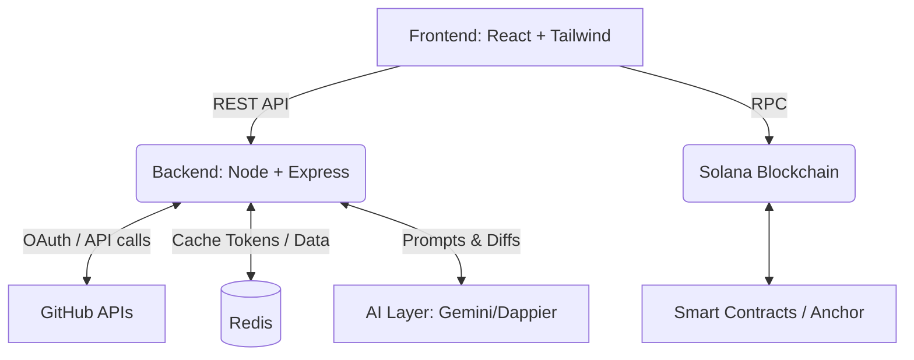
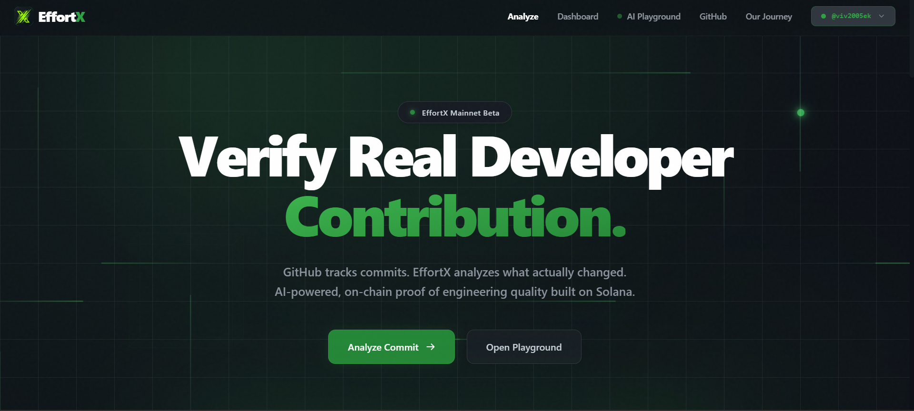
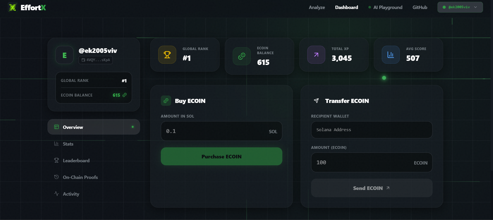
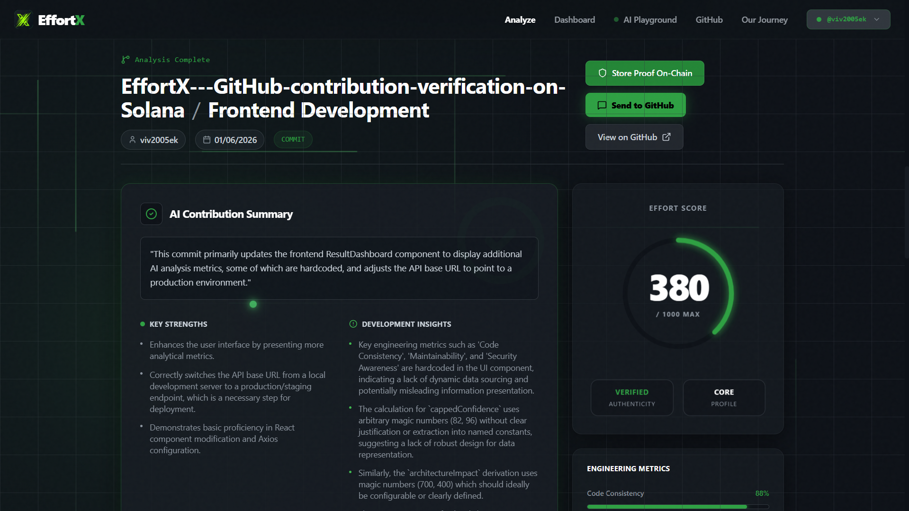
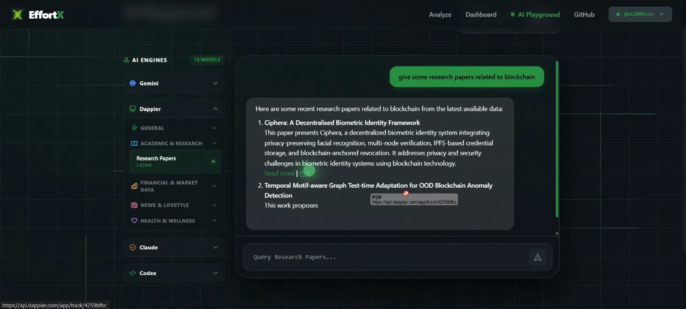

<div align="center">
  
  <h1>EffortX</h1>
  <p><b>AI-Verified Proof of Real Engineering Work</b></p>
  
  
  
  
  
  
  
  
</div>

<br />

## Table of Contents

- [Overview](#overview)
- [The Problem](#the-problem)
- [The Solution](#the-solution)
- [Key Features](#key-features)
- [Product Walkthrough](#product-walkthrough)
- [Technical Architecture](#technical-architecture)
- [Tech Stack](#tech-stack)
- [GitHub Integration](#github-integration)
- [AI System](#ai-system)
- [Blockchain Layer](#blockchain-layer)
- [ECOIN Economy](#ecoin-economy)
- [Repository Structure](#repository-structure)
- [Local Development Setup](#local-development-setup)
- [Environment Variables](#environment-variables)
- [API Overview](#api-overview)
- [Screenshots Section](#screenshots-section)
- [Security](#security)
- [Roadmap](#roadmap)
- [Contributing](#contributing)
- [Team](#team)

---


Links And Resources:

Live Website
https://effort-x-seven.vercel.app/

Demo 
 https://www.youtube.com/watch?v=obsvaDMGX60

Github
https://github.com/viv2005ek/EffortX---GitHub-contribution-verification-on-Solana

Presentation (PPT)
https://drive.google.com/file/d/1MF7-03Cyu7L1MSdAE0lbDUr6RnczowOx/view?usp=sharing

EffortX Details Document:
https://docs.google.com/document/d/1euj_EaTQ9MYlRs-LcdBlGw-yLovbWCClQ0XBH_NFy54/edit?usp=sharing

Effortx Build Journey:
https://x.com/EffortX05


## Overview

GitHub tracks activity. **EffortX tracks contribution quality.**

EffortX is a decentralized, AI-powered platform designed to analyze, score, and cryptographically verify software engineering contributions. By integrating deep AI analysis (powered by Google Gemini and Dappier models) with the Solana blockchain, EffortX provides a verifiable, immutable record of an engineer's true impact and code quality.

---

## The Problem

- **Commit counts are misleading**: 100 commits changing typos look the same as 1 commit resolving a complex algorithmic issue.
- **Contribution streaks do not measure impact**: Green squares on a GitHub profile do not indicate code quality or architectural understanding.
- **AI-generated code is increasing**: It's harder than ever to distinguish between blindly copy-pasted code and thoughtful engineering.
- **Recruiters cannot easily evaluate engineering quality**: Non-technical recruiters struggle to evaluate a developer's real capabilities from a GitHub profile alone.
- **Open-source contributors struggle to prove impact**: It's difficult to build a portable, verifiable reputation across different organizations and repositories.

---

## The Solution

EffortX bridges the gap between activity and impact by leveraging AI to analyze the *substance* of commits and PRs, and blockchain to store the verified results.

**Complete User Flow:**

1. **Connect Wallet:** User links their Solana wallet (e.g., Phantom).
2. **Connect GitHub:** User authenticates via GitHub OAuth to establish identity.
3. **Install GitHub App:** User installs the EffortX GitHub App to grant repo access.
4. **Analyze Commit/PR:** User submits a GitHub URL for analysis.
5. **Generate AI Review:** The backend fetches the diff and uses Gemini 2.5 to evaluate code complexity, security, and quality.
6. **Publish Review to GitHub:** EffortX posts a detailed AI review as a comment directly on the PR/Commit.
7. **Store Proof on Solana:** The generated "Effort Score" and metadata are permanently stored on-chain.
8. **Earn ECOIN:** The user is rewarded with ECOIN tokens based on the quality of their contribution.
9. **Use AI Playground:** Users can spend their earned ECOIN to query specialized AI models (Research, Markets, News) within the EffortX platform.

---

## Key Features

- 🔐 **GitHub OAuth Authentication:** Securely verify developer identity.
- 🤖 **GitHub App Integration:** Deep repository access to fetch raw diffs and post comments.
- 🧠 **AI Commit Analysis:** Understand the "why" and "how" behind code changes.
- 📊 **AI Pull Request Analysis:** Holistic evaluation of complex feature merges.
- 📝 **GitHub Review Publishing:** Automated, context-aware comments posted directly to GitHub.
- ⛓️ **On-Chain Proof Storage:** Immutable, cryptographically secure records of engineering effort.
- 💰 **ECOIN Rewards:** Tokenomics designed to incentivize high-quality contributions.
- 🏆 **Leaderboards:** Rank developers by actual impact, not just activity.
- 🕹️ **Multi-Model AI Playground:** Premium AI access gated by earned reputation (ECOIN).
- 👛 **Wallet Integration:** Seamless Solana wallet connectivity.
- 📈 **Contribution History:** A unified dashboard of verified engineering proofs.

---

## Product Walkthrough

1. **Onboarding**: Arrive at the landing page, connect your Phantom wallet, and link your GitHub account. Your on-chain profile is strictly mapped to your GitHub identity.
2. **Analysis Request**: Paste the URL of a recent GitHub commit or pull request. EffortX checks permissions and retrieves the diff.
3. **The Engine**: The EffortX backend parses the diff and sends it to our specialized AI prompt. The AI evaluates the change across multiple dimensions (complexity, security, best practices).
4. **The Verdict**: A detailed report is generated, scoring the contribution from 1-100.
5. **Publishing**: The AI report is posted as a comment on the GitHub PR/Commit, providing immediate value to the repository maintainers.
6. **Minting Proof**: You click "Store Proof on Chain". A Solana transaction is signed, permanently recording your Effort Score on the blockchain and rewarding you with ECOIN.
7. **Playground**: Head over to the AI Playground. Spend your newly earned ECOIN to run queries against premium Dappier AI models.

---

## Technical Architecture



- **Frontend**: Handles user interaction, wallet connection, and data visualization.
- **Backend API**: Orchestrates OAuth flows, coordinates GitHub API calls, manages the AI prompt pipeline, and handles secure endpoints.
- **GitHub APIs**: Provides access to repository diffs, PR metadata, and comment publishing capabilities.
- **AI Layer**: Processes code diffs to generate qualitative and quantitative engineering metrics.
- **Redis**: Caches temporary OAuth tokens and rate-limits API requests to ensure performance and security.
- **Solana Program**: Stores verified "Effort Proofs" immutably and manages the ECOIN SPL token economy.

---

## Tech Stack

**Frontend:**

- React (Vite)
- TypeScript/JavaScript
- Tailwind CSS (Custom Design System)
- Framer Motion (Micro-animations)
- `@solana/wallet-adapter`

**Backend:**

- Node.js
- Express.js
- Axios (External API calls)

**AI:**

- Google Gemini 2.5 Flash
- Dappier Premium Models (Finance, News, Research)

**Storage:**

- Redis (Session & Token caching)

**Blockchain:**

- Solana (Devnet/Mainnet)
- Anchor Framework
- Web3.js

**Integrations:**

- GitHub OAuth App (User Identity)
- GitHub App (Repository Access)

---

## GitHub Integration

EffortX utilizes a dual-authentication strategy with GitHub:

1. **GitHub OAuth**: Used strictly for **identity verification**. This ensures that the user attempting to claim a commit actually owns the GitHub account that authored it.
2. **GitHub App**: Installed on specific repositories or organizations. This grants EffortX the necessary permissions (`pull_requests: write`, `contents: read`) to fetch raw code diffs and post AI reviews as comments without requiring the user to hand over invasive personal access tokens.

When an analysis completes, the backend uses the GitHub App Installation Token to securely post the generated AI report back to the repository.

---

## AI System

The AI layer is the core of the EffortX evaluation engine.

- **Commit & PR Analysis**: Code diffs are extracted and passed through a highly optimized prompt template to Gemini 2.5.
- **Effort Scoring**: The AI calculates a deterministic "Effort Score" (1-100) based on cognitive complexity, lines changed (with nuance for boilerplate), architectural impact, and bug-fix difficulty.
- **Review Generation**: A human-readable Markdown report is generated, highlighting strengths, weaknesses, and potential security issues.
- **AI Playground**: An integrated space where users can access specialized Dappier models (e.g., real-time stock market data, research papers), paid for exclusively using the platform's native ECOIN.

---

## Blockchain Layer

The Solana blockchain serves as the ultimate source of truth for engineering reputation.

- **Proof Verification**: Once a score is generated, the frontend constructs a transaction containing the score, the GitHub URL, and a cryptographic hash of the AI report.
- **Immutable Records**: The transaction is signed by the user and stored in a PDA (Program Derived Address) linked to their wallet.
- **ECOIN Balances**: The Solana program automatically mints/transfers ECOIN to the user based on the Effort Score stored in the proof.

---

## ECOIN Economy

ECOIN is the utility token of the EffortX ecosystem.

- **Earning**: Developers earn ECOIN strictly by contributing high-quality code. Higher Effort Scores yield more ECOIN.
- **Spending**: ECOIN is burned/spent to access premium features, primarily the **Multi-Model AI Playground**.
- **Utility**: It acts as a Proof-of-Work currency. You cannot buy ECOIN; you can only earn it by writing good code.

---

## Repository Structure

```text
EffortX/
├── Frontend/                 # React UI application
│   ├── src/
│   │   ├── components/       # Reusable UI components
│   │   ├── context/          # React Context (Solana, Auth)
│   │   ├── services/         # API client functions
│   │   ├── solana/           # Web3.js integration & IDL
│   │   ├── App.jsx           # Main application routing
│   │   └── main.jsx          # Entry point
│   └── package.json
├── commit-analyzer-offchain/ # Node.js Backend API
│   ├── src/
│   │   ├── controllers/      # Route logic (github, ai, playground)
│   │   ├── prompts/          # AI system prompts
│   │   ├── routes/           # Express route definitions
│   │   ├── services/         # Core business logic
│   │   ├── utils/            # Helpers (Redis client)
│   │   └── server.js         # Express server setup
│   └── package.json
└── Solana - onChain/         # Anchor smart contracts
    ├── programs/
    └── tests/
```

---

## Local Development Setup

### Prerequisites

- Node.js (v18+)
- Redis Server running locally (or via Docker)
- Solana CLI & Wallet (Phantom recommended)

### 1. Clone the repository

```bash
git clone https://github.com/viv2005ek/EffortX.git
cd EffortX
```

### 2. Run Redis

Ensure Redis is running on `redis://127.0.0.1:6379`.

```bash
# Example using Docker
docker run -d -p 6379:6379 redis
```

### 3. Setup Backend

```bash
cd commit-analyzer-offchain
npm install
# Create a .env file (see Environment Variables section)
npm run dev
```

### 4. Setup Frontend

```bash
cd ../Frontend
npm install
npm run dev
```

The app will be available at `http://localhost:5173`.

---

## Environment Variables

### Backend (`commit-analyzer-offchain/.env`)

```env
PORT=5000
GITHUB_TOKEN=your_github_token
GEMINI_API_KEY=your_gemini_api_key
DAPPIER_API_KEY=your_dappier_api_key
NODE_ENV=development
GITHUB_CLIENT_ID=your_oauth_client_id
GITHUB_CLIENT_SECRET=your_oauth_client_secret
REDIS_URL=redis://127.0.0.1:6379
```

---

## API Overview

### Auth Routes (`/api/auth`)

- `POST /github/exchange` - Exchanges OAuth code for GitHub username and caches token in Redis.

### Analysis Routes (`/api/analysis`)

- `POST /analyze` - Accepts a GitHub URL, verifies repo access via GitHub App, fetches diff, runs Gemini AI, and posts a review.

### Playground Routes (`/api/playground`)

- `POST /dappier/chat` - Proxies requests to Dappier models after verifying ECOIN payment on the frontend.

### Webhooks Routes (`/api/webhooks`)

- `POST /github` - Receives GitHub App installation events.

---

## Demo & Screenshots

<div align="center">
  <a href="https://www.youtube.com/watch?v=obsvaDMGX60" target="_blank">
    
  </a>
  <br/>
  <p><b>📺 Watch the full EffortX Demo on YouTube</b></p>
</div>
<br />

| Landing Page | Dashboard |
|:---:|:---:|
|  |  |

| Analysis Report | AI Playground |
|:---:|:---:|
|  |  |

---

## Security

- **OAuth Flow**: Standard OAuth 2.0 ensures EffortX never sees user passwords.
- **Redis Token Storage**: GitHub access tokens are cached securely in Redis with strict TTLs (Time-To-Live). They are never exposed to the frontend.
- **GitHub App Permissions**: The GitHub App operates on a least-privilege principle, requesting only what is needed (read diffs, write comments).
- **Backend API Security**: Cross-Origin Resource Sharing (CORS) is strictly configured. Rate limiting is applied to AI endpoints to prevent abuse.
- **On-Chain Identity**: The Solana smart contract enforces that only the wallet mapped to the GitHub username can mint proofs for that username's commits.

---

## Roadmap

**Near-term:**

- [ ] **GitHub Check Runs**: Automatically run EffortX analysis as a CI/CD check on PRs.
- [ ] **Organization Dashboards**: Aggregated metrics for engineering teams.
- [ ] **Expanded Multi-Model Support**: Integrate Claude 3 and GPT-4o into the analysis pipeline.

**Long-term:**

- [ ] **Developer Reputation Network**: A decentralized protocol for identity and skill verification.
- [ ] **Recruiter Portal**: A dedicated UI for hiring managers to query verifiable candidate skills.
- [ ] **Reputation APIs**: Allow third-party job boards to integrate EffortX scores.

---

## Contributing

We welcome contributions from the community!

1. **Star and Fork** the repository.
2. Create a new branch (`git checkout -b feature/amazing-feature`).
3. Commit your changes (`git commit -m 'Add some amazing feature'`).
4. Push to the branch (`git push origin feature/amazing-feature`).
5. Open a Pull Request.

Please ensure your code passes all linting and includes appropriate tests.

---

## Team

**Vivek Kumar Garg**  
Creator & Lead Developer

- [GitHub](https://github.com/viv2005ek)
- [LinkedIn](https://www.linkedin.com/in/vivek-kumar-garg-097677280/)
- [X (EffortX Official)](https://x.com/EffortX05)
- [X (Creator)](https://x.com/viv2005ek)


---

> *"GitHub tracks commits. EffortX tracks contribution quality."*
